# 数据中台

## 1.系统设置

### 1.基础设置

描述：全局系统基础配置

添加


查询


### 2.用户管理

描述：系统登录用户

添加用户：

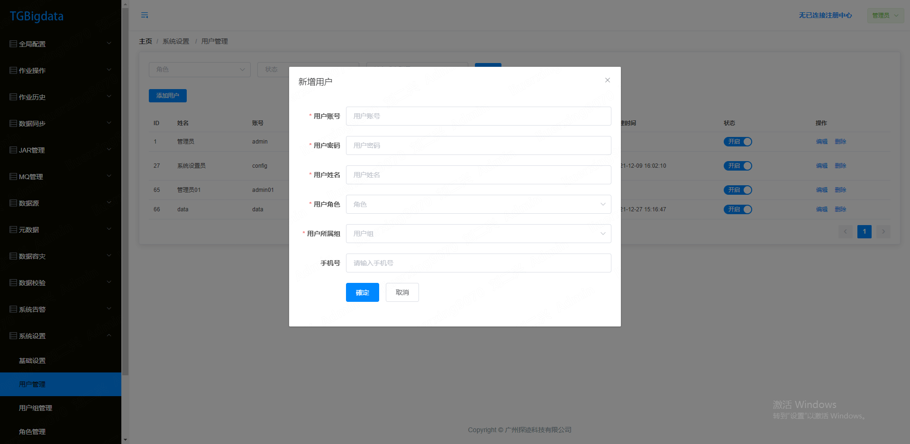

查询用户

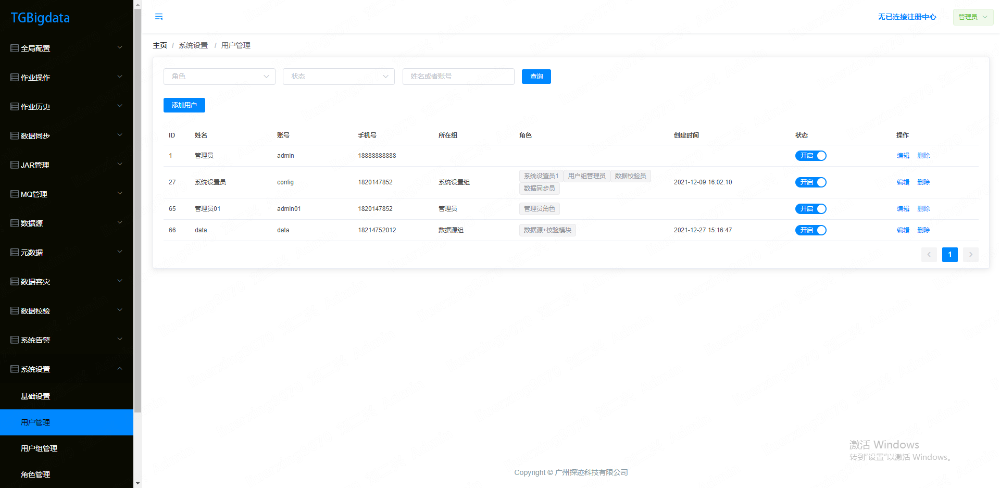

修改用户状态

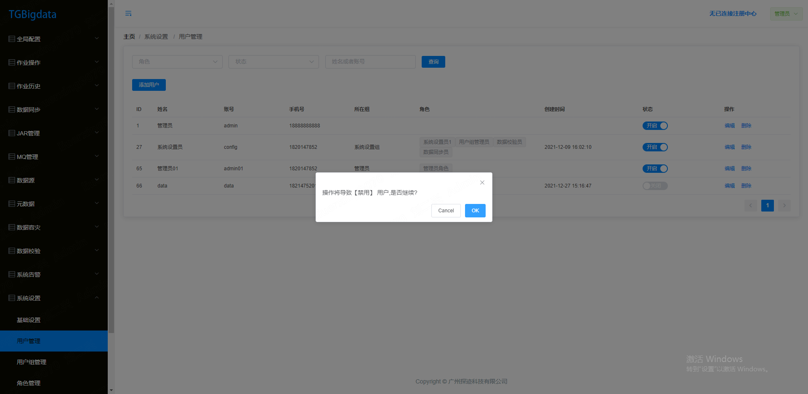

编辑

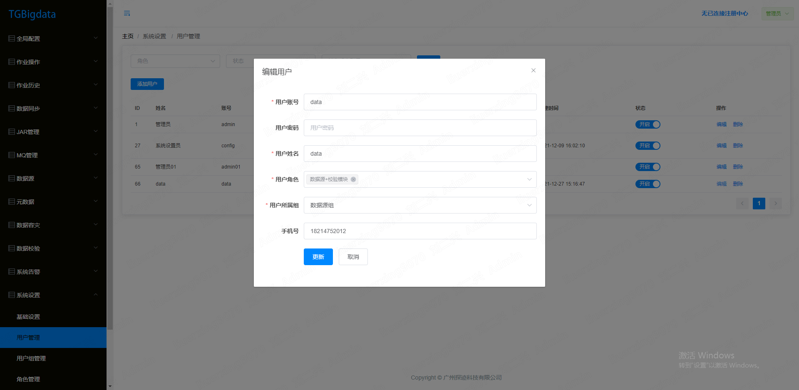

### 3.用户组管理

描述：描述用户所属用户组，用于多租户资源隔离

添加、修改、状态修改

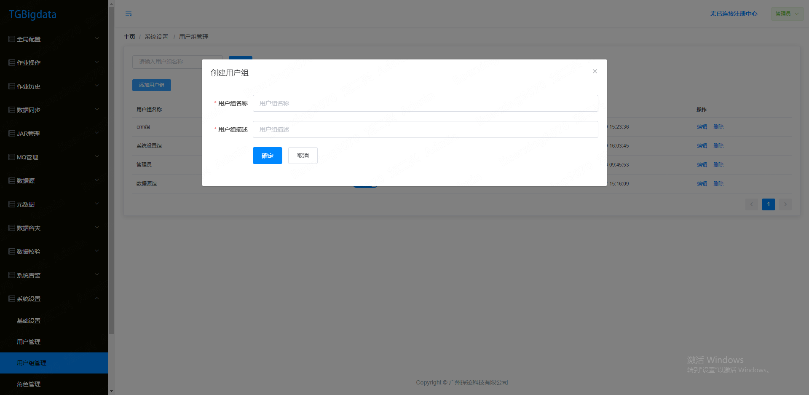

多租户配置核心代码：

MybatisConfig.java

```Java

@Component
@MapperScan(basePackages = {"com.tungee.bigdata.database.mysql.dao"})
public class MybatisConfig {
    @Autowired
    MyTenantLineHandler myTenantLineHandler;
    @Bean
    public MybatisPlusInterceptor mybatisPlusInterceptor() {
        MybatisPlusInterceptor interceptor = new MybatisPlusInterceptor();
        TenantLineInnerInterceptor tenantLineInnerInterceptor = new TenantLineInnerInterceptor();
        tenantLineInnerInterceptor.setTenantLineHandler(myTenantLineHandler);
        interceptor.addInnerInterceptor(tenantLineInnerInterceptor);//多租户插件
        return interceptor;
    }
}

```


MyTenantLineHandler.java

```Java

@Data
@Configuration
@ConfigurationProperties(prefix = "muti-tenant")
public class MyTenantLineHandler implements TenantLineHandler {

    /**
     * 是否开启多租户模式
     */
    private boolean openMultiTenant;

    /**
     * 预置的管理员用户组id(对应user_group表)
     */
    private String adminGroupId;

    /**
     * 开启多租户模式下需要拦截的表
     */
    private String[] tenantTables;


    /**
     * 获取租户ID 实际应该从用户信息中获取
     * @return
     */
    @Override
    public Expression getTenantId() {

    }

    /**
     * 获取租户表字段 默认为tenant_id
     *
     * @return
     */
    @Override
    public String getTenantIdColumn() {

    }

    /**
     * 表过滤，返回true，表示当前表不进行租户过滤
     *
     * @param tableName 当前执行表名
     * @return
     */
    @Override
    public boolean ignoreTable(String tableName) {

    }
}


```


### 4.角色管理

描述：用户的角色，权限集合

查询、添加、编辑、状态变更

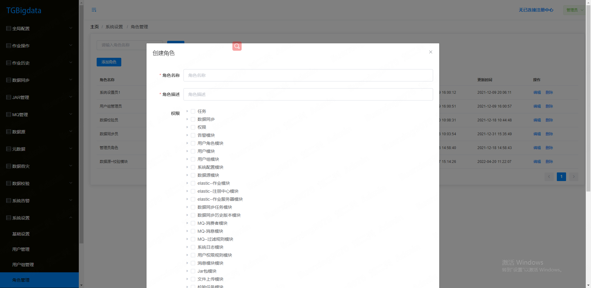

### 5.操作日志

描述：接口访问记录操作

查询、删除

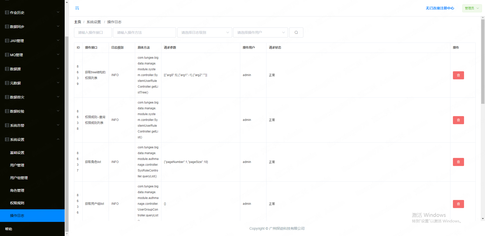

代码相关，切面拦截

com/tungee/bigdata/manage/module/syslog/aspect/LogAspect.java

## 2.数据源

### 1.数据源管理

描述：支持多种数据源，设计模块：数据校验、数据同步、数据容灾、元数据管理

添加、查询、编辑、删除、连接测试等

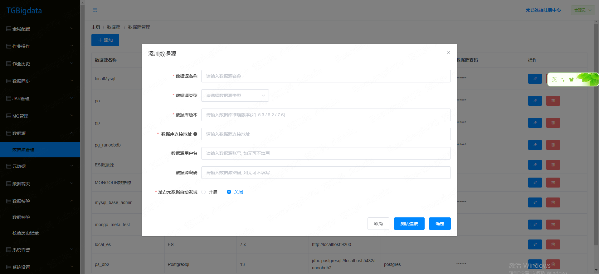

## 3.数据校验

### 1.数据校验

描述：elasticjob调度执行，mysql与mongodb之间数据校验，记录执行结果统计

添加、查询、修改、删除

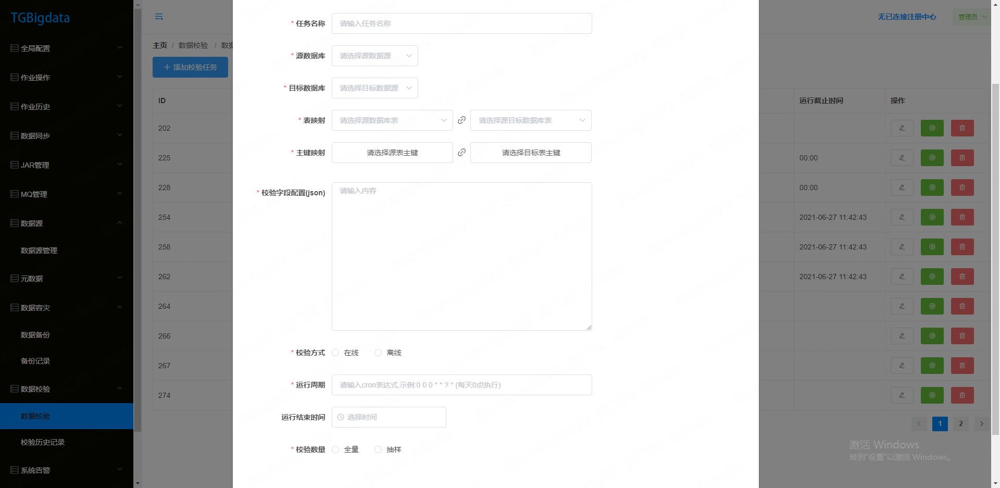


代码相关：elasticjob zk配置、监听器、数据源元数据信息获取

核心代码：

注册中心配置 com/tungee/bigdata/elasticjob/config/ElasticJobConfig.java

```Java
@Configuration
@Data
@ConfigurationProperties(prefix = "elasticjob")
public class ElasticJobConfig {

    private String serverlists;
    private String namespace;
    private Integer maxSleepTimeMilliseconds;
    private Integer maxRetries;

    /***************************************************zk配置相关**********************************************************/
    /**
     * zk配置
     *
     * @return
     */
    @Bean
    public ZookeeperConfiguration zkConfig() {
        return new ZookeeperConfiguration(serverlists, namespace);
    }

    /**
     * zk注册中心
     *
     * @param config
     * @return
     */
    @Bean(initMethod = "init")
    public ZookeeperRegistryCenter regCenter(ZookeeperConfiguration config) {
        Optional.of(maxRetries).ifPresent(config::setMaxRetries);
        Optional.of(maxSleepTimeMilliseconds).ifPresent(config::setMaxSleepTimeMilliseconds);
        return new ZookeeperRegistryCenter(config);
    }
```


com/tungee/bigdata/verification/handler/ElasticJobHandler.java

监听器实现执行记录：spi机制实现接口

### 2.校验历史记录

描述：记录执行结果

查询

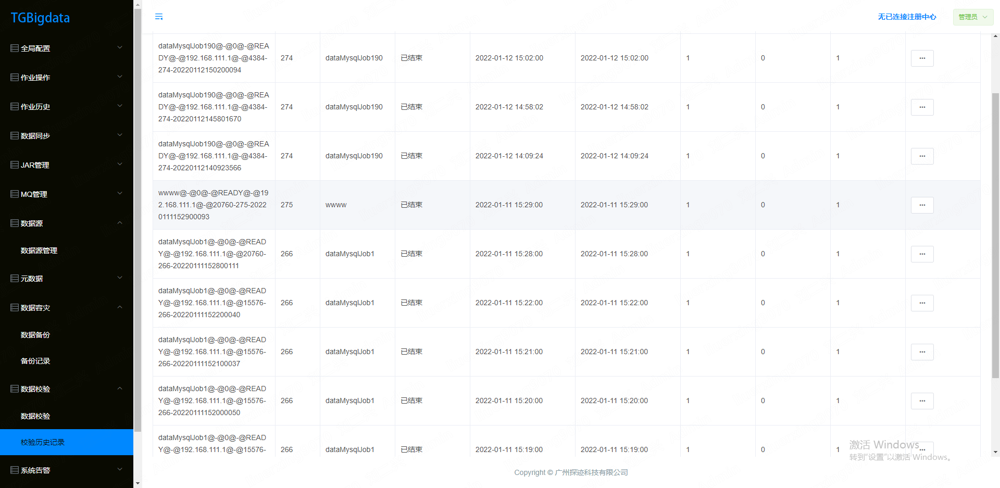


## 4.数据容灾

### 1.数据备份

描述：对mysql、mongodb数据进行备份

添加、查询、编辑、删除

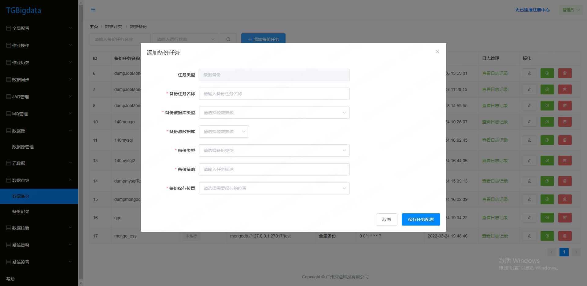

### 2.备份记录

描述：记录备份执行结果

查询

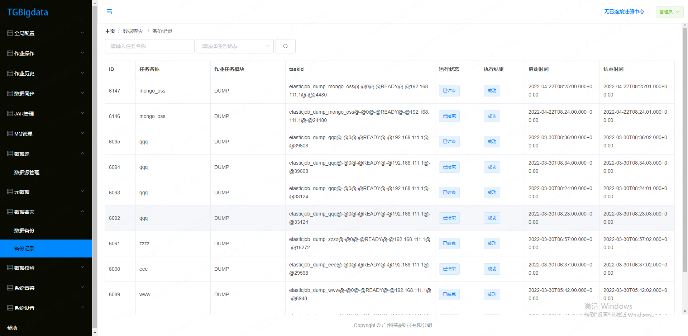

## 5.元数据

### 1.元数据管理

描述：对各种数据源进行元数据采集，以数据源模块的数据源为基础

查询、同步、基本信息、元数据信息

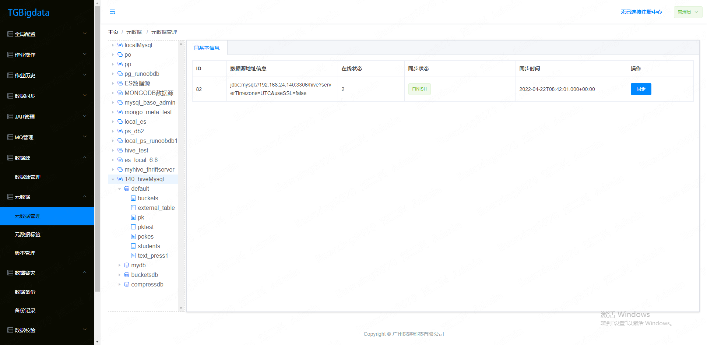

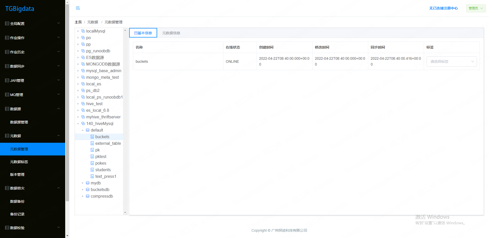

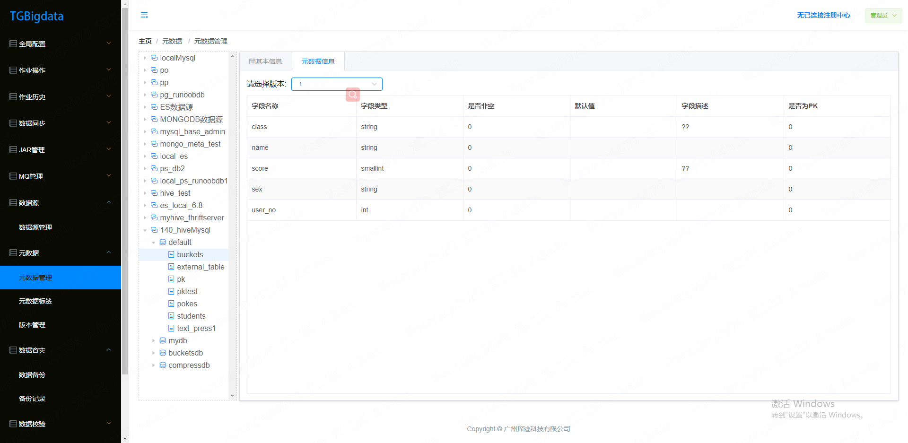

核心代码：

采集器：

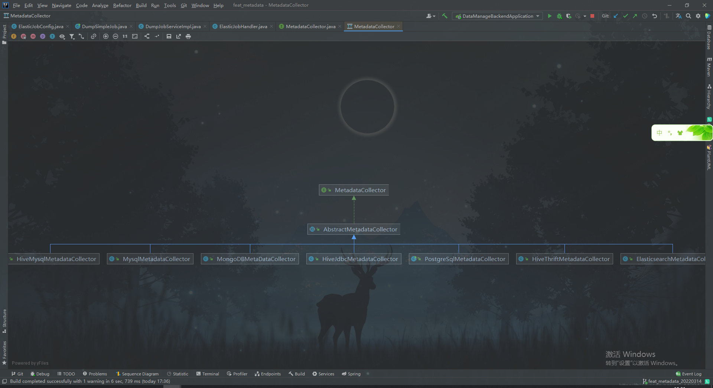

postgresql使用jdbc

hive多种方式采集：mysql jdbc、hive jdbc、metastore api

### 2.元数据标签

描述：表添加标签

查询、编辑、删除

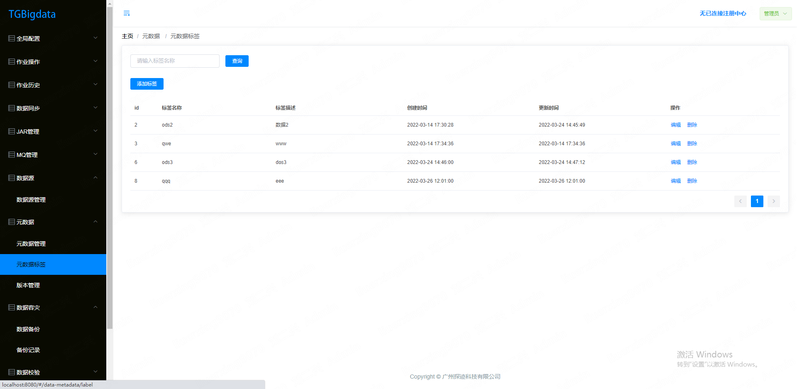

### 3.版本管理

描述：表字段元数据版本对比

查询

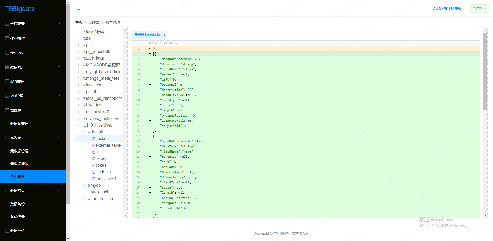


## 6.相关代码

1.elasticjob zk配置，api handler，监听器

2.权限管理多租户、操作日志

3.元数据hive、postgresql采集器

